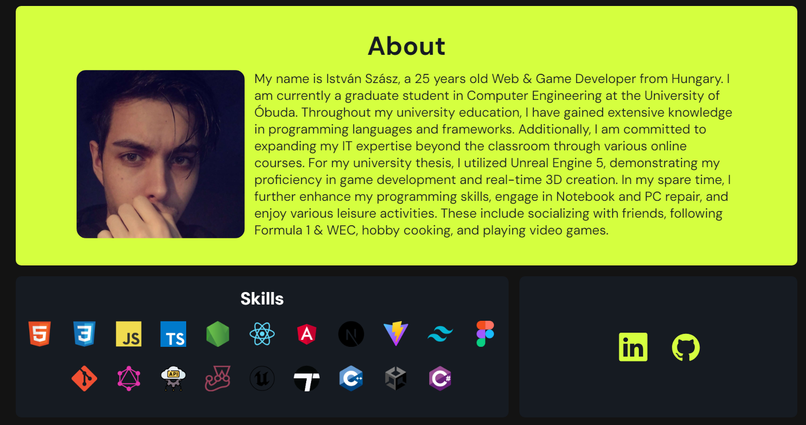

# New Portfolio Page (Version 2)
Welcome to my newly redesigned personal portfolio, where you can check all my works, skills, and projects. 

This version represents a significant upgrade from my previous site, reflecting my growth and expertise in modern web development technologies.

The Website is published on Netlify.

The informations on this page are Up to date.

## Key Technologies Used
- Design: Figma
- Development: TypeScript, React, Tailwind CSS, Vite
- Deployment: Netlify

## Features
- Contacts
- Resume
- About
- Skills
- Projects

## Screenshots




## Run Locally

Note: Please ensure you have installed <code><a href="https://nodejs.org/en/download/">nodejs</a></code>

Clone my repository
```bash
  git clone https://github.com/istvanszasz99/portfolio_v2.git
```

Go to the project directory
```bash
  cd portfolio_v2
```

Install dependencies
```bash
  npm install
```

View project in browser
```bash
  npm start
```

## Preview
https://istvanszasz99.netlify.app

## Author
- [@istvanszasz99](https://www.github.com/istvanszasz99)
  
